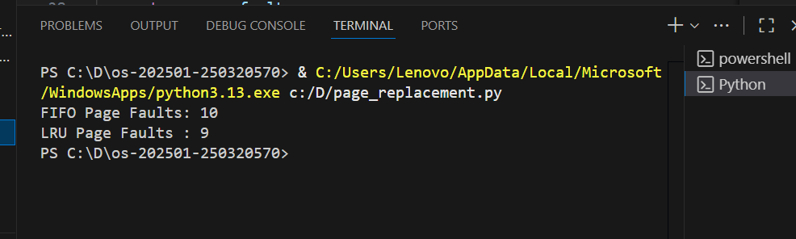

# Laporan Praktikum Minggu [10]
Topik: [Manajemen Memori – Page Replacement (FIFO & LRU)]

---

## Identitas
- **Nama**  : [Abdi Hnafi Alghifari]  
- **NIM**   : [250320570]  
- **Kelas** : [1DSRA]

---

## Tujuan
1. Mengetahui dan menjelaskan cara kerja algoritma Page Replacement.
2. Menganalisis prinsip dan langkah kerja algoritma FIFO (First In First Out).
3. Menganalisis prinsip dan langkah kerja algoritma LRU (Least Recently Used).
4. Menghitung dan membandingkan jumlah page fault yang dihasilkan oleh algoritma FIFO dan LRU.
5. Membandingkan kinerja dan efisiensi FIFO dan LRU dalam penggunaan memori.

---

## Dasar Teori
1. FIFO (First In First Out)
FIFO mengganti page yang paling awal masuk ke memori tanpa mempertimbangkan frekuensi atau waktu terakhir penggunaan page tersebut.
2. LRU (Least Recently Used)
LRU mengganti page yang paling lama tidak digunakan berdasarkan waktu akses terakhir.
3. Page Replacement
Page replacement adalah proses mengganti page yang berada di memori dengan page baru ketika memori penuh dan terjadi page fault.
4. Algoritma Page Replacement
Algoritma page replacement menentukan page mana yang akan dikeluarkan dari memori untuk meminimalkan jumlah page fault.
5. Manajemen Memori
Manajemen memori adalah mekanisme pengaturan penggunaan memori sehingga beberapa proses dapat berjalan bersamaan tanpa konflik dan dengan pemanfaatan memori yang optimal.

---

## Langkah Praktikum
1. Menyiapkan Dataset

    Gunakan reference string berikut sebagai contoh:

         7, 0, 1, 2, 0, 3, 0, 4, 2, 3, 0, 3, 2

    Jumlah frame memori: 3 frame.

2. Implementasi FIFO
- Simulasikan penggantian halaman menggunakan algoritma FIFO.
- Catat setiap page hit dan page fault.
- Hitung total page fault.

3. Implementasi LRU
- Simulasikan penggantian halaman menggunakan algoritma LRU.
- Catat setiap page hit dan page fault.
- Hitung total page fault.

4. Eksekusi & Validasi
- Jalankan program untuk FIFO dan LRU.
- Pastikan hasil simulasi logis dan konsisten.
- Simpan screenshot hasil eksekusi.

5. Analisis Perbandingan
- Buat tabel perbandingan seperti berikut:

| Algoritma	| Jumlah Page Fault | Keterangan |
|-----------|--------------------|------------|
| FIFO |	... |	... |
| LRU	| ... |	... |

- Jelaskan mengapa jumlah page fault bisa berbeda.
- Analisis algoritma mana yang lebih efisien dan alasannya.

6. Commit & Push

        git add .
        git commit -m "Minggu 10 - Page Replacement FIFO & LRU"
        git push origin main


---

## Kode / Perintah
```bash
def fifo(reference_string, frame_size):
    frames = []
    page_faults = 0
    index = 0

    print("=== Simulasi FIFO ===")
    for page in reference_string:
        if page not in frames:
            page_faults += 1
            if len(frames) < frame_size:
                frames.append(page)
            else:
                frames[index] = page
                index = (index + 1) % frame_size
        print(f"Page {page} -> Frame {frames}")

    return page_faults


def lru(reference_string, frame_size):
    frames = []
    page_faults = 0

    print("\n=== Simulasi LRU ===")
    for page in reference_string:
        if page not in frames:
            page_faults += 1
            if len(frames) < frame_size:
                frames.append(page)
            else:
                frames.pop(0)
                frames.append(page)
        else:
            frames.remove(page)
            frames.append(page)

        print(f"Page {page} -> Frame {frames}")

    return page_faults


# Data Praktikum
reference_string = [7, 0, 1, 2, 0, 3, 0, 4, 2, 3, 0, 3, 2]
frame_size = 3

# Eksekusi
fifo_faults = fifo(reference_string, frame_size)
lru_faults = lru(reference_string, frame_size)

print("\n=== Hasil Akhir ===")
print("Total Page Fault FIFO:", fifo_faults)
print("Total Page Fault LRU :", lru_faults)

```

---

## Hasil Eksekusi
Sertakan screenshot hasil percobaan atau diagram:


---

## Analisis
- Analisis perbandingan 

  | Algoritma	| Jumlah Page Fault | Keterangan |
  |-----------|--------------------|------------|
  | FIFO |	10 | FIFO kurang efisien karena tidak mempertimbangkan pola akses |
  | LRU	| 9 |	Lebih sedikit page fault dibanding FIFO, Page yang sering diakses dipertahankan lebih lama |

- Jelaskan mengapa jumlah page fault bisa berbeda?
1. FIFO (First In First Out)
   - Mengganti page yang paling lama masuk ke memori
   - Tidak memperhatikan apakah page tersebut masih sering digunakan
   - Akibatnya, page yang masih dibutuhkan bisa terhapus
   ➡ Hal ini menyebabkan page fault tambahan ketika page tersebut diakses kembali.


---

## Kesimpulan
Tuliskan 2–3 poin kesimpulan dari praktikum ini.

---

## Quiz
1. [Pertanyaan 1]  
   **Jawaban:**  
2. [Pertanyaan 2]  
   **Jawaban:**  
3. [Pertanyaan 3]  
   **Jawaban:**  

---

## Refleksi Diri
Tuliskan secara singkat:
- Apa bagian yang paling menantang minggu ini?  
- Bagaimana cara Anda mengatasinya?  

---

**Credit:**  
_Template laporan praktikum Sistem Operasi (SO-202501) – Universitas Putra Bangsa_
