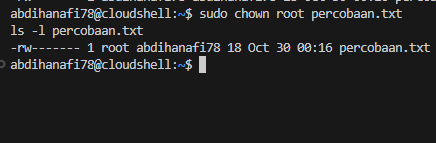

# Laporan Praktikum Minggu [X]
Topik: [Tuliskan judul topik, misalnya "Arsitektur Sistem Operasi dan Kernel"]

---

## Identitas
- **Nama**  : Abdi Hanafi Alghifari 
- **NIM**   : 250320570
- **Kelas** : 1DSRA

---

## Tujuan
Tujuan praktikum minggu ini adalah  mampu mengoperasikan perintah Linux dasar dengan benar, memahami sistem izin (permission).  


---

## Dasar Teori
Tuliskan ringkasan teori (3–5 poin) yang mendasari percobaan.
1. Navigasi sistem file dengan ls, pwd, cd, dan cat.
2. Pengaturan hak akses file menggunakan chmod.
3. Pengubahan kepemilikan file menggunakan chown.

---

## Langkah Praktikum
1. Setup Environment

   - Gunakan Linux (Ubuntu/WSL).
   - Pastikan folder kerja berada di dalam direktori repositori Git
     praktikum:

               praktikum/week3-linux-fs-permission/

2. Eksperimen 1 – Navigasi Sistem File Jalankan perintah berikut:

       pwd
       ls -l
       cd /tmp
       ls -a

    - Jelaskan hasil tiap perintah.
    - Catat direktori aktif, isi folder, dan file tersembunyi (jika ada).  

3. Eksperimen 2 – Membaca File Jalankan perintah:

         cat /etc/passwd | head -n 5

    - Jelaskan isi file dan struktur barisnya (user, UID, GID, home, shell).
  
4. Eksperimen 3 – Permission & Ownership Buat file baru:

       echo "Hello <NAME><NIM>" > percobaan.txt
       ls -l percobaan.txt
       chmod 600 percobaan.txt
       ls -l percobaan.txt

    - Analisis perbedaan sebelum dan sesudah chmod.
    - Ubah pemilik file (jika memiliki izin sudo):

          sudo chown root percobaan.txt
          ls -l percobaan.txt
   
   - Catat hasilnya.

5. Eksperimen 4 – Dokumentasi

   - Ambil screenshot hasil terminal dan simpan di:

           praktikum/week3-linux-fs-permission/screenshots/

   - Tambahkan analisis hasil pada laporan.md.

6. Commit & Push
     
       git add .
       git commit -m "Minggu 3 - Linux File System & Permission"
       git push origin main


---

## Kode / Perintah
Tuliskan potongan kode atau perintah utama:
``` 
    pwd
    ls -l
    cd /tmp
    ls -a

    cat /etc/passwd | head -n 5

    echo "Hello <NAME><NIM>" > percobaan.txt
    ls -l percobaan.txt
    chmod 600 percobaan.txt
    ls -l percobaan.txt
    
    sudo chown root percobaan.txt
    ls -l percobaan.txt
   
```

---

## Hasil Eksekusi
Sertakan screenshot hasil percobaan atau diagram:

Eksperimen 1 – Navigasi Sistem File Jalankan perintah berikut:

 
 
| Perintah | Fungsi | hasil output | Ketereangan / Penjelasan |
------------|-------|---------------|--------------------------|
| pwd | Menampilkan lokasi atau direktori kerja aktif saat ini (Print Working Directory). Berguna untuk mengetahui sedang berada di folder mana di dalam sistem. | /home/abdihanafi78 | Menunjukkan bahwa user saat ini berada di direktori home milik pengguna abdihanafi78. |
| ls -1 | Menampilkan daftar isi direktori dalam format panjang (long listing). Menunjukkan nama file/folder, ukuran, hak akses (permission), pemilik, grup, dan waktu modifikasi terakhir. | -rwxr-xr-x 1 abdihanafi78 abdihanafi78 913 Oct 29 23:10 README-cloudshell.txt | Hasilnya menunjukkan satu file bernama README-cloudshell.txt di direktori /home/abdihanafi78 dengan izin baca/tulis/eksekusi untuk pemilik. |
| cd /tmp | Mengganti direktori kerja ke folder /tmp (temporary). Folder ini digunakan sistem untuk menyimpan file sementara yang dibuat oleh aplikasi atau proses yang sedang berjalan. | (tidak menampilkan output) | Setelah perintah dijalankan, direktori aktif berubah dari /home/abdihanafi78 menjadi /tmp. |
| ls -a | Menampilkan semua isi direktori, termasuk file dan folder tersembunyi (hidden files) yang biasanya diawali dengan tanda titik .. | .  ..  cloudcode-temp2L9f4X  cloudcode-temp4kb8ks  cloudcode-tempUtsB8u  gemini-idc-server-42801.json  node-compile-cache  vscode-git-6b9de5ab7d.sock  vscode-skaffold-events-logs  ... | Menampilkan seluruh isi folder /tmp, termasuk file sementara dari Cloud Code, Gemini, VS Code, dan Minikube. Terdapat juga file tersembunyi . (current directory) dan .. (parent directory). |


Catat direktori aktif, isi folder, dan file tersembunyi (jika ada).

| Keterangan | Isi / Lokasi |
|-------------|---------------|
| Direktori aktif awal | /home/abdihanafi78 | 
| Direktori aktif akhir | /tmp |
| Isi folder /home/abdihanafi78 | README-cloudshell.txt |
| Isi folder /tmp | cloudcode-temp2L9f4X, cloudcode-temp4kb8ks, cloudcode-tempUtsB8u, gemini-idc-server-42801.json, node-compile-cache, vscode-git-6b9de5ab7d.sock, vscode-skaffold-events-logs, dll | 
| File Tersembunyi | . (current directory) dan .. (parent directory) |


Eksperimen 2 – Membaca File Jalankan perintah:


| Isi Baris File / etc / passwd | Penjelasan (username,UID,GID,home,shell,keteranagan) |
|--------------------------------|----------------------------------|
| root:x:0:0:root:/root:/bin/bash | Username: root → akun superuser.Password field: x (tersimpan di /etc/shadow).UID: 0 → hak akses penuh ke sistem.GID: 0 → grup root.Home: /root.Shell: /bin/bash (bisa login interaktif).Keterangan: akun utama administrator sistem Linux. |
| daemon:x:1:1:daemon:/usr/sbin:/usr/sbin/nologin | Username: daemon → akun sistem.Password field: x.UID: 1, GID: 1.Home: /usr/sbin.Shell: /usr/sbin/nologin (tidak bisa login).Keterangan: digunakan untuk menjalankan proses latar belakang (background service). |
| bin:x:2:2:bin:/bin:/usr/sbin/nologin | Username: bin → akun sistem lama.Password field: x.UID: 2, GID: 2.Home: /bin.Shell: /usr/sbin/nologin.Keterangan: digunakan untuk kepemilikan file biner sistem. Tidak digunakan login. | 
| sys:x:3:3:sys:/dev:/usr/sbin/nologin | Username: sys → akun sistem.Password field: x.UID: 3, GID: 3.Home: /dev.Shell: /usr/sbin/nologin.Keterangan: akun internal untuk manajemen perangkat (device management). Tidak bisa login. |
| sync:x:4:65534:sync:/bin:/bin/sync | Username: sync → akun utilitas sistem.Password field: x.UID: 4, GID: 65534 (nogroup).Home: /bin.Shell: /bin/sync (menjalankan perintah sinkronisasi).Keterangan: digunakan untuk menulis data dari buffer ke disk. Bukan akun pengguna biasa | 

Eksperimen 3 – Permission & Ownership Buat file baru:


- Analisis perbedaan seblum dan sesudah chmod :

| Aspek | sebelum chmod | setelah chmod | Analisis Singkat|
|--------|---------------|---------------|-----------------|
| Permission | -rw-r--r--(644) | -rw-------(600) | Awalnya bisa dibaca oleh semua user, kini hanya pemilik yang bisa membca dan menulis |
| Owner | abdihanafi78 | abdihanafi78 | Tidak berubah, pemilik file tetap sama. | 
| Group | abdihanafi78 | abdihanafi78 | Tidak berubah. |
| Hak Owner | Read, Write | Read, Write | Tetap bisa baca dan ubah file. |
| Hak Group | Read | Tidak ada akses | Akses group dihapus untuk keamanan. |
| Hak Others | Read | Tidak ada akses | Pengguna lain tidak bisa melihat isi file. |
| Keamanan File | Rendah (dapat dibaca publik) | Tinggi (privasi terjaga) | Akses lebih terbatas, cocok untuk file rahasia. |

- Ubah pemilik file (jika memiliki izin sudo):


 
- Catat hasilnya :

| Aspek | Sebelum | Sesudah | Keterangan Singkat |
|--------|---------|---------|----------------------|
| Pemilik (Owner) | abdihanafi78 | root | Berubah — kini file dimiliki oleh user root. |
| Group | abdihanafi78 | abdihanafi78 | Tidak berubah. |
| Permission | -rw------- | -rw------- | Tidak berubah, hanya kepemilikan yang diganti. |
| Isi File | Tetap sama | Tetap sama | Perintah chown tidak memengaruhi isi file. |
| Akses User Biasa | Bisa baca & tulis | Tidak bisa ubah tanpa sudo | File sekarang hanya bisa diubah oleh root. |

 

---

## Analisis
- Jelaskan makna hasil percobaan.  
  1. Perubahan Kepemilikan (Ownership)
	    - Sebelum perintah dijalankan, file percobaan.txt dimiliki oleh   user abdihanafi78.
	    -	Setelah perintah sudo chown root percobaan.txt, pemilik file berubah menjadi root.
	    -	Artinya, hak penuh atas file kini dimiliki oleh user root, bukan lagi user biasa.
  2. Hak Akses (Permission) Tidak Berubah
	    -	Nilai permission tetap -rw-------, yang berarti hanya pemilik file (sekarang root) yang dapat membaca dan menulis file tersebut.
	    -	Karena pemiliknya sudah root, user biasa (abdihanafi78) tidak lagi bisa membuka atau mengedit file tanpa menggunakan sudo.
  3. Isi File Tetap Sama
	    -	Perintah chown tidak memengaruhi isi atau struktur file, hanya mengganti siapa pemilik file tersebut.
  4. Makna Umum / Tujuan Percobaan
	    - Percobaan ini menunjukkan fungsi utama perintah chown, yaitu mengubah kepemilikan file atau direktori.
	    - Hal ini penting dalam sistem Linux untuk mengatur kontrol akses dan keamanan, agar hanya pengguna tertentu (seperti root) yang dapat mengelola file sensitif.

- Analisis peran chmod dan chown dalam keamanan sistem Linux.
    - chmod : mengatur apa yang boleh dilakukan (izin akses)
         1. Mengontrol siapa yang bisa mengakses data
         2. Mencegah modifikasi tak sah
         3. Mencegah eksekusi program berbahaya
         4. Menetapkan batas minimal hak akses (Prinsip Least Privilege)

    - chown : menentukan siapa yang berhak melakukannya (kepemilikan)
      Keduanya merupakan fondasi utama keamanan sistem file Linux, mencegah akses tidak sah, kebocoran data, dan modifikasi berbahaya.
         1. Menetapkan tanggung jawab akses
         2. Mencegah eskalasi hak akses
         3. Mendukung pembagian sumber daya antar grup.
---

## Kesimpulan
Tuliskan 2–3 poin kesimpulan dari praktikum ini.

1. Perintah chmod digunkan untuk mengatur hak akses (permission)file, seperti siapa yang bolrh membaca, menulis, atau mengeksekusi file.
2. Perintah chown digunakan untuk mengubah kepemiilkan (ownership)file, baik pemilik (owner) maupun grupnya.
3. Perubahan permission dan ownership penting untuk menjaga keamanan dan kontrol akses dalam sistem linux, agar filr hanaya bisa diakses oleh pengguna yang berwenang.

---

## Quiz
1. Apa fungsi dari perintah chmod?

   **Jawaban:**  
   digunakan untuk menentukan siapa yang dapat membaca, menulis, atau mengeksekusi sebuah file atau direktori.

2. Apa arti dari kode permission rwxr-xr--?
  
   **Jawaban:**  
   Kode permission rwxr-xr-- menunjukkan hak akses (izin) terhadap sebuah file atau direktori di sistem operasi Linux/Unix.
 
 Arti Tiap Bagian

| Kategori |	Simbol |	Arti |	Penjelasan |
|-----------|----------|------|--------------|
| Owner | rwx | 	Read, Write, | Execute	Pemilik file bisa membaca, menulis, dan menjalankan file |
| Group |	r-x | Read, Execute	| Anggota grup bisa membaca dan menjalankan file, tapi tidak bisa menulis |
| Others |	r-- |	Read only | Pengguna lain hanya bisa membaca file, tidak bisa menulis atau menjalankan | 

3. Jelaskan perbedaan antara chown dan chmod.

   **Jawaban:**  

   | chown (change owner) |	Mengubah kepemilikan (owner dan/atau group) dari file atau direktori | 
   |-----------------------|--------------------------------------|

   | chmod (change mode) |	Mengubah izin akses (permission) terhadap file atau direktori | 
   |----------------------|-----------------------------------------|


---

## Refleksi Diri
Tuliskan secara singkat:
- Apa bagian yang paling menantang minggu ini?  
  
  memahami  perbedaan antara perintah chmod dan chown, untuk peruban perubahan hak akses dan kepemilikan 

- Bagaimana cara Anda mengatasinya? 
 
  mencoba setiap perintah dan berusaha memahami serta membandingkan sebelum dan sesudah menjalankan perintah 
---

**Credit:**  
_Template laporan praktikum Sistem Operasi (SO-202501) – Universitas Putra Bangsa_
